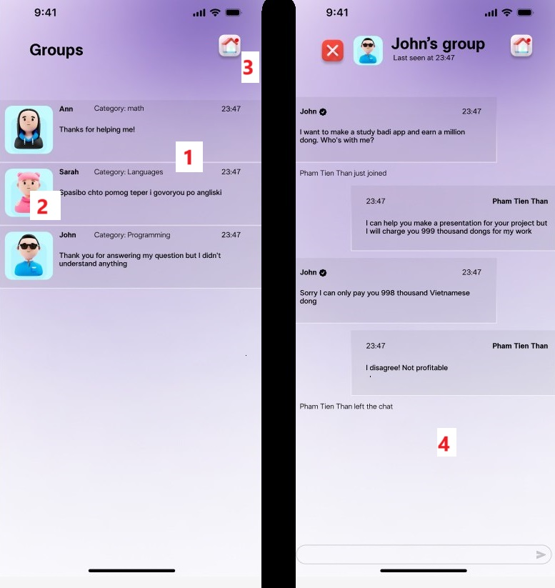

<a id="anchor"></a>

# Study buddy App 
The web application is for searching people with same interests or hobby. User can:
* find person or group with approached topics:
* make events, 
* make competetion with other participants, 
* edit profile and hobbies.

***

The project is written due to __NextJS__ + __Clerk__ + __Redux Toolkit__ + __TypeScript__ + __TailwindCSS__ + __multer__

***

### Page structure:

1. Main
2. Messages
3. Profile
4. Not Found

***

### Instruction:
* Main Page

1. The list of studies / hobbies
2. Navbar
3. Change Theme

* Messages



1. Common chat
2. Person who user chat with
3. Button 'back to the Main Page'
3. Chat with user (Pham Tien Than)

Feature 
: Despite ordinary registration / login ways I wrote before (manually), I decided to user library __Clerk__

```
import React from 'react'
import { SignIn } from '@clerk/nextjs';

type Props = {}

const SignInComponent = (props: Props) => {
  return (
    <div className='w-full h-full flex items-center justify-center'>
        <SignIn />
    </div>
  )
}

export default SignInComponent
```

[Up](#anchor)